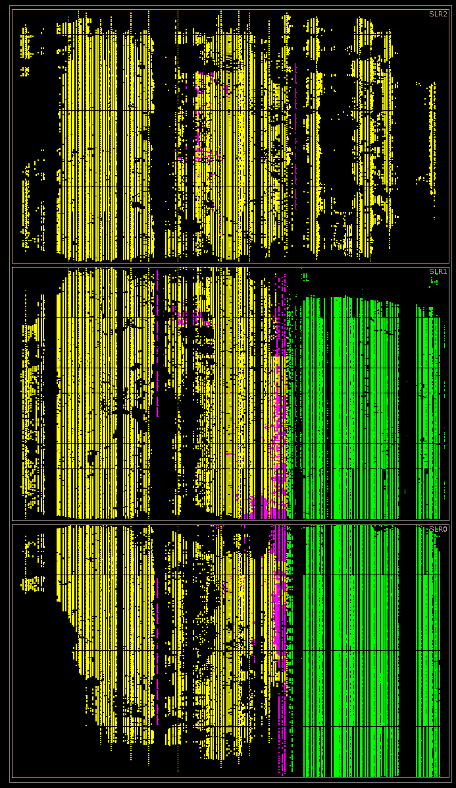
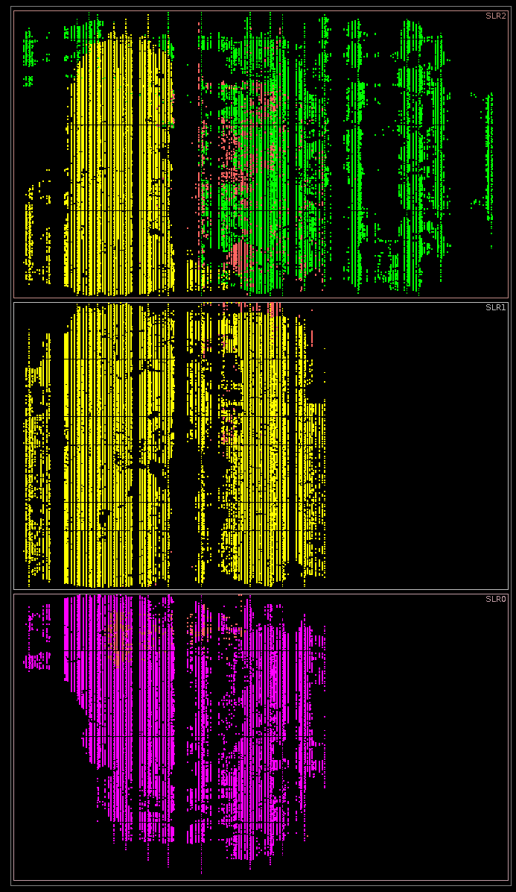
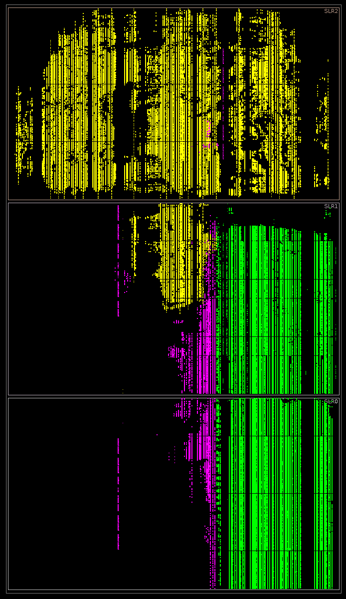

# VDF Alliance FPGA Competition – Round 3

### January 30, 2020

## Team Name
Geriatric Guys with Gates

## Team Members
* Steve Golson
* Kurt Baty

## Round 3 Results

We designed two implementations. Here are their latencies:

|            |  F1 latency (ns/sq)  | Theoretical latency (ns/sq) |
|-----------:|:---------------:|:----------------------:|
| 3-phase    |       TBD       |    55.545              |
| Iterative  |       60.2      |    57.282              |

Theoretical latency is calculated from Vivado static timing analysis reports, taking into account all the available positive slack in the critical path.

## Introduction

The competition challenge was to design a modular square VDF implementation using an algorithm "sufficiently different" from the baseline Ozturk algorithm [1]. We decided to implement Montgomery modular multiplication [2][3].

The Montgomery method relies on selecting a suitable radix R which is coprime to the modulus N such that R > N. Now calculate the modular inverse R\_inv such that (R x R\_inv) mod N = 1 where R\_inv < N. Finally find N' such that (R x R\_inv) – (N x N') = 1 and N' < R. Note that R, R\_inv, N, N' are all constants.

To convert a number A\_normal into the N-residue Montgomery representation:

    A = (A_normal x R) mod N

and to convert back:

    A_normal = (A x R_inv) mod N

This conversion is expensive, however the iterative computation stays in Montgomery space, thus the conversion cost is amortized over a large number of iterations. Thus it can be done in software with little performance penalty.

_Montgomery reduction_ is modular squaring in Montgomery space. The basic steps are as follows [2]:

    T = A x A
    M = ((T mod R) x N') mod R
    U = (T + (M x N)) / R
    if U < N then
       A_next = U
    else
       A_next = U - N

Montgomery's key insight was that if R is a power of two:

         R_MSB
    R = 2

then dividing by R and computing modulo R are trivial operations. We are left with three multiply operations, an add, and a final subtraction.

Here is simple Verilog code which implements Montgomery reduction. For this competition we have MOD\_LEN = 1024, thus:

    logic [MOD_LEN-1:0]         sq_in;
    logic [MOD_LEN-1:0]         sq_out;

    logic [MOD_LEN*2-1:0]       t;
    logic [MOD_LEN+R_MSB-1:0]   mXn;
    logic [R_MSB*2-1:0]         tXnp;
    logic [R_MSB-1:0]           tMODr, m;
    logic [MOD_LEN+R_MSB:0]     u_wide;
    logic [MOD_LEN:0]           u;
    logic [MOD_LEN+1:0]         uMINUSn;

    t = sq_in * sq_in;          // 1k-bit square -> 2k-bit result
    tMODr = t[R_MSB-1:0];       // lower 1k-bit (mod R)
    tXnp = tMODr * n_prime;     // 1k-bit multiply by 1k-bit constant -> 2k-bit result
    m = tXnp[R_MSB-1:0];        //   but keep only lower 1k-bit (mod R)
    mXn = m * n;                // 1k-bit multiply by 1k-bit constant -> 2k-bit result
    u_wide = mXn + t;           // 2k-bit add with carry
    u = u_wide[MOD_LEN+R_MSB:R_MSB];  // keep only upper 1k-bit with carry (divide by R)

    uMINUSn = {1'b0,u} - n;  // 1k-bit subtract (padded with sign bit)
    if (uMINUSn[MOD_LEN+1])  // compare two 1k-bit values by looking at sign bit
       sq_out = u[MOD_LEN-1:0];        // u < n, so return u
    else
       sq_out = uMINUSn[MOD_LEN-1:0];  // u >= n, so return u - n

Walter [4] shows that if R is large enough then the final subtraction is not necessary. Specifically R\_MSB must be greater than (MOD\_LEN + 1). So we set R\_MSB = 1026, and our required arithmetic operations now look like this:

    t = sq_in * sq_in;    // 1024-bit square -> 2048-bit result

    m = tMODr * n_prime;  // 1026-bit multiply by 1026-bit constant -> 2052-bit result
                          // but keep only lower 1026-bit (mod R)

    mXn = m * n;          // 1026-bit multiply by 1024-bit constant -> 2050-bit result

    sq_out = mXn + t;     // 2050-bit sum from adding 2050-bit and 2048-bit values
                          // but throw away lower 1026-bits (divide by R)
                          // leaving 1024-bit result

## 3-phase Implementation

Our first implementation has dedicated hardware for each function, thus allowing single-cycle flow-through operation. Each arithmetic operator is optimized independently.

### Square

During Round 2 of this competition we developed modules `multiply_51x51` and `square_51` which each use just 6 DSPs. This works because the largest unsigned DSP multiplier in our Ultrascale+ chip is 26x17 bits. Our 51-bit operation maps very nicely onto this DSP, because 3x17 = 51 and 2x26 = 52, thus 6 DSPs are required.

Our 1024-bit square is built using these modules. Since 20x51 = 1020 bits, a final column of `mult_26x4` modules (with one DSP each) is used to reach the 1024 bits needed. Only 1,301 DSPs are required to implement a full 1024-bit square.

This design uses the 6-to-3 compressor we developed during Round 1.

The final 2048-bit full adder uses a novel scheme inspired by Källström and Gustafsson [5]. It generates 16-bits of carry propagation with a single CARRY8 cell.

The module name is `square_wide_51s`.

### Multiplier

We implemented a 1026x1026 multiplier using the 26x17 DSP multiplier cells. This module is instantiated twice.

Note that 29x26 + 16x17 = 1026. Thus if you stack 29 DSPs along their 26-bit edge, and then above that stack 16 DSPs along their 17-bit edge, you can exactly fill 1026 bits. So two rectangular blocks of DSPs, with the first block 29x61 and the second block 16x40, will provide enough DSPs to generate all required partial products for the full 1026-bit multiply (with a few bits extra along one side). This requires a total of 2,409 DSPs. This is a very efficient packing; it uses only 28 more DSPs than the theoretical minimum count.

For the first multiplier instance `mult1` only the least significant 1026 output bits are kept. The generate loops for the compressor logic takes this into account, and the upper half of the compressor never gets elaborated. The unused DSP cells are optimized away during synthesis, and as a result only 1,240 DSPs are required to implement `mult1`.

This multiplier uses the 3-to-2 compressors from the baseline Ozturk design. The final full adder uses the same logic as in the square described above.

The module name is `mult_1026x1026`.

### Adder

A 2050-bit adder is needed to perform the final operation `mXn + t`.

The second multiplier instance `mult2` is already summing up 129 partial product terms in its compressor. Increasing this by one more term adds very little complexity (and very little delay) to the compressor. So we feed the value `t` as an additional compressor term, and our module `mult_1026x1026` is now actually a multiplier-accumulator (MAC).

### Bypass registers

As we discovered in Round 2, this flow-through design has an enormous number of timing paths. We found that the Vivado router has a very difficult time finding a complete legal routed solution.

To help it out, we add flops to the outputs of instances `square` and `mult1`. These flops have bypass muxes which are selected by a top-level control signal. During synthesis+implementation we use case analysis on this control to force the bypass muxes such that the placer and router see the flops, and thus there are many fewer distinct timing paths. After routing is complete, we turn the muxes back to bypass and do a final post-route physical optimization.

Rather than divide down a faster clock, we use the Xilinx MMCM to generate phase edges at arbitrary points in our main cycle. This lets us tune the edge locations to optimize the critical paths. Hence our name **3-phase** for this implementation.

### SystemVerilog functions

R\_MSB and the modulus N are input parameters to this design. We wrote SystemVerilog constant functions to generate the additional values required for Montgomery reduction. The modular inverse algorithm used to calculate R\_inv was adapted from an algorithm given by Ireland [6], which he adapted from Knuth (of course). Computing N' is straightforward once you have R, R\_inv, and N. It is important to provide enough bit width for intermediate calculations.

The Vivado testbench includes functions to convert to and from Montgomery representation.

During actual F1 operation, the necessary conversions are done in software. See source file `MSU.cpp`.

### Other issues

Our wrapper, CDC (clock domain crossing), and AXI interface are similar to our Round 2 design.

Likewise, we used our Round 2 synthesis and implementation flow. However due to the MMCM programming problems uncovered in Round 2, now we maintain the same clock definitions throughout the flow.

### Floorplan

`mult1` was placed in the bottom die SLR0. `square` is placed in the upper die SLR2. `mult2` is not restricted, and tends to end up in the top two die.

## Iterative Implementation

For this implementation we use a single instance of module `mult_1026x1026` and iterate for three clocks to compute first the square and then the two multiplies.

The input muxes for this instance are fairly simple, since for each input there are only two possible source registers. During the remaining cycle, the input is a constant.

This requires much less logic than the 3-phase design.

## Performance and utilization comparison

|     |  F1 latency (ns/sq) | Theoretical latency (ns/sq) |  Power (W) | Typical runtime | Repository Directory name |
|-----------:|:---------------:|:-------------:|:-----:|:-------:|:-----------------------------|
| 3-phase    |       TBD       |    55.545     |  43.2 |  15h 4m | `modsq_GGG_Montgomery`       |
| Iterative  |       60.2      |    57.282     |  45.7 |  3h 54m | `modsq_GGG_Montgomery_iter`  |

Theoretical latency is calculated from Vivado static timing analysis reports, taking into account all the available positive slack in the critical path. For the Iterative design, the latency is three periods of the design clock. Power is reported by Vivado. Runtime is for the full SDAccel synthesis/implementation flow using Xilinx Vivado 2018.3 tools on AWS instance type z1d.2xlarge.

|            |  Total LUT | Total nets | modsqr LUT | modsqr DSP | modsqr CLB flops | modsqr CARRY8 |
|-----------:|:---------------:|:---------------:|:---------------:|:---------------:|:---------------------:|:------------------:|
| 3-phase    |     479,042     |   4,867,121     |     320,871     |    4,950        |        2,899          |        320         |
| Iterative  |     289,519     |   2,681,329     |     131,195     |    2,409        |        4,167          |        128         |

The 3-phase design includes an additional 3,074 CLB flops which are bypassed and never used.

----------------------------------------------------------
### 3-phase die utilization

This is a plot of our submitted 3-phase design, highlighted with:

- green : SDAccel static region (kernel and device management logic)
- yellow : modsqr (including wrapper)
- magenta : the rest of SDAccel dynamic region (AXI and other interface logic)

Here's another plot of the 3-phase design showing just the modsqr logic and highlighting each arithmetic operator:

- green : instance `square`
- magenta : instance `mult1`
- yellow : instance `mult2`
- red : top-level flops and control logic

----------------------------------------------------------
### Iterative die utilization

This is a plot of our submitted iterative design.

- green : SDAccel static region (kernel and device management logic)
- yellow : modsqr (including wrapper)
- magenta : the rest of SDAccel dynamic region (AXI and other interface logic)

----------------------------------------------------------

## Problems

### Placement directives

We suffered greatly from instabilities in the placement and routing algorithms. We had tremendous difficulties in getting placements that would successfully route. To reduce the total logic, we designed very highly-utilized CLBs which each required a large number of connections. This high ratio of nets to logic seems to exceed the abilities of the Xilinx architecture. The placer would find a solution, but the router would be unable to complete the design.

### Flow

Since we were required to use the SDAccel flow for signoff, it was not possible to iterate on late stages of the flow by starting from an intermediate result. Instead, each experimental run had to start from scratch with new synthesis. Thus iterating on design changes took a long time.

### Clocking

The MMCM programming problems we discovered during Round 2 are a huge issue. If we had a better understanding of MMCM programming, and the SDAccel flow, we think much faster results are achievable.

For example, we were able to successfully close timing (positive slack) on a version of the 3-phase design with modsqr latency 55.545 ns/sq. And we have a version of the iterative design with modsqr latency 54.915 ns/sq. But during those same runs we cannot set MMCM attributes to generate the necessary clocks to run at those speeds.

### Simulation

Our complex generate loops seem to confuse the SystemVerilog parser used by the Vivado simulator and the hw_emu simulator. Neither of these tools can successfully simulate the full design. However the parser used by Vivado synthesis seems to get it right, because we have working hardware (at least for the iterative design).

Elaboration in the Vivado simulator takes about 6 hours.

Elaboration in the hw_emu simulator takes about 9 hours. Simulation takes another 8 hours.

### Power

We have not been able to get the 3-phase design to work in F1. This may be due to power issues. Most likely the inrush current violates the F1 hardware limits. We should try slowly ramping-up rather than abruptly running at full speed.

### SystemVerilog parser

Vivado synthesis does not support `unique0 case`. This makes it hard to write efficient one-hot state machines.

## Potential performance improvements

Our algorithm in FPGA does not compare favorably with Ozturk. This design requires three wide full adders, which puts an inherent limit on the possible speed. In contrast, the Ozturk coefficient calculations never require long-word carry propagation.

Using our 6-to-3 compressor in the multiplier would save a significant amount of LUTs and reduce logic delays. However this tends to cause routability problems.

Better placement guidance would definitely improve results. The 3-phase design would benefit from better locations for each of the three arithmetic modules.

Our full adder may benefit from placement help, because by default Vivado does not seem to know how best to place these novel CARRY8 chains.

There is more opportunity for logic optimization in the 3-phase design. We expect the 3-phase to be faster than the iterative design, but that hasn't typically been the case. Furthermore, we have been unable to get our 3-phase design to work on F1. Chasing down that problem has greatly limited our overall experimentation.

The answers to many of these questions are outside the scope of this contest. Basically we ran out of time.

## References

1. Öztürk, Erdinç. "Modular multiplication algorithm suitable for low-latency circuit implementations." (2019):1-9. [Available online.](https://eprint.iacr.org/2019/826.pdf)
2. Montgomery, Peter L. "Modular multiplication without trial division." _Mathematics of computation_ 44.170 (1985): 519-521. [Available online.](https://www.ams.org/journals/mcom/1985-44-170/S0025-5718-1985-0777282-X/home.html)
3. Koç, Çetin Kaya, Tolga Acar, and Burton S. Kaliski. "Analyzing and comparing Montgomery multiplication algorithms." _IEEE micro_ 16.3 (1996): 26-33. [Available online.](https://www.microsoft.com/en-us/research/wp-content/uploads/1996/01/j37acmon.pdf)
4. Walter, Colin D. "Montgomery exponentiation needs no final subtractions." _Electronics letters_ 35.21 (1999): 1831-1832. [Available online.](https://pdfs.semanticscholar.org/0e6a/3e8f30b63b556679f5dff2cbfdfe9523f4fa.pdf)
5. Källström, Petter, and Oscar Gustafsson. “Fast and area efficient adder for wide data in recent Xilinx FPGAs.” _26th International Conference on Field-Programmable Logic and Applications_, IEEE, 2016, pp. 338–341., doi:10.1109/FPL.2016.7577348. [Available online.](http://liu.diva-portal.org/smash/record.jsf?pid=diva2%3A967655&dswid=8490)
6. Ireland, David. "The Euclidean algorithm and the extended Euclidean algorithm." (2018). [https://www.di-mgt.com.au/euclidean.html](https://www.di-mgt.com.au/euclidean.html).

## Contributions by Team Members

### Steve Golson
* Overall algorithm and architecture
* Design and project management
* Flow development for synthesis and implementation
* Arguing with Vivado and SDAccel

### Kurt Baty
* Wide arithmetic components: square, multiplier, compressor, adder
* Xilinx expertise
* Placement advice
* Developed creative ways to confuse the simulator

## Team Photo

Kurt Baty and Steve Golson
